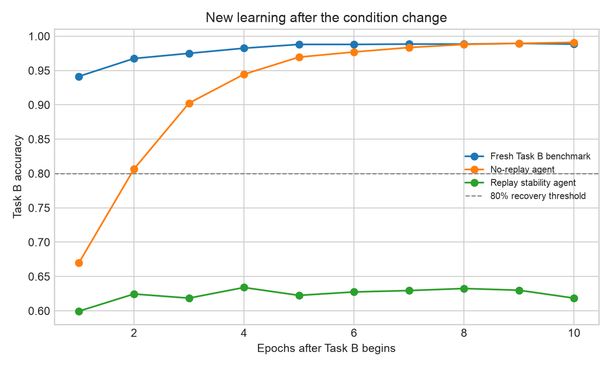
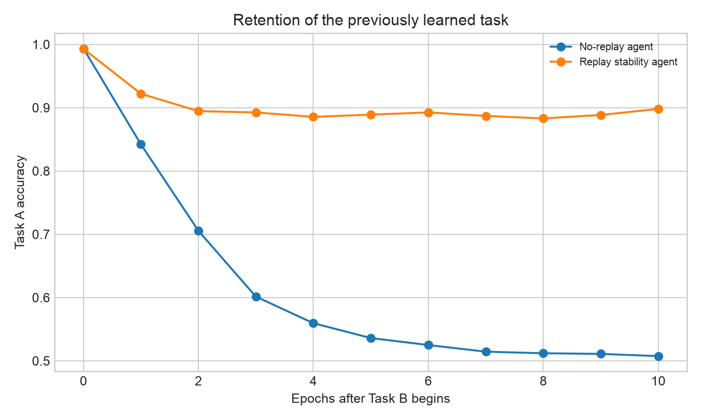

# Study

**Article:** *Plasticity Loss in Deep Reinforcement Learning A Survey*

**Authors:** Timo Klein, Lukas Miklautz, Kevin Sidak, Claudia Plant, and Sebastian Tschiatschek

**DOI/URL:** <https://arxiv.org/abs/2411.04832>

**Replication Type:** Proxy replication

**Computational Environment:** Python

**Primary Packages:** PyTorch, NumPy, pandas, and matplotlib

**Random Seed:** 20250927

**Repository:** <https://github.com/hf2431/anly735-lab02-hf2431>

# 1. Research Claim

## What result are you attempting to reproduce?

The anchor paper is a survey, so it does not provide one original training run that can be reproduced exactly. I therefore focus on its broader stability--plasticity claim: when a learning problem changes, an already-trained neural network can retain some capability from the earlier condition while becoming less effective at learning what comes next. This is important because a lower score immediately after a change is not enough to diagnose plasticity loss. The more informative evidence is the post-change trajectory: does the model improve, how quickly does it improve, and what previous capability is retained while it adapts? My small experiment treats these as separate outcomes rather than reducing the question to one final accuracy. The target is a narrow proxy for the phenomenon synthesized by Klein et al. [@klein2024plasticity].

# 2. Replication Strategy

## How will you investigate the claim?

This is a proxy replication. The original survey synthesizes findings from many studies, but it does not supply a single dataset, model checkpoint, and learning trajectory for a direct rerun. I constructed a controlled two-task experiment that makes the relevant change visible. Two identical multilayer perceptrons first learn Task A. After the task changes to Task B, one persistent agent receives Task B examples plus a small replay stream from Task A, while the other receives only Task B examples. A freshly initialized Task B model provides a simple learning-rate benchmark. I compare Task A retention, Task B accuracy, and the number of post-change epochs needed to reach 80% Task B accuracy. This does not test every mechanism in the survey; it tests whether a stability--plasticity tradeoff can be observed transparently in a reproducible toy setting.

# 3. Data

The data are synthetic and generated by `code/lab02_analysis.py`, so no restricted or personally identifiable data are involved. Each task contains 2,000 training observations and a separate 2,000-observation evaluation set. Each observation has two independent standard-normal features. In Task A, the binary target is whether feature 1 is positive. In Task B, the target is whether feature 2 is positive. The task switch therefore changes the predictive rule while keeping the sample format and difficulty comparable. The unit of analysis is one simulated observation and the outcome is a binary class label. There are no missing values and no external preprocessing steps. The synthetic construction differs from the reinforcement-learning settings reviewed in the anchor paper, but it gives a clean way to separate retention of the old rule from learning of the new rule.

# 4. Method

The model is a small multilayer perceptron with two input features, one hidden layer of 32 ReLU units, and a single sigmoid output. Both persistent agents begin from the same seeded initialization and train on Task A for 10 epochs using stochastic gradient descent with learning rate 0.10 and batch size 128. At the condition change, the replay stability agent trains on Task B while also replaying Task A examples with replay weight 2.0. The no-replay agent trains only on Task B. A fresh Task B benchmark is initialized independently and trained only on Task B. All agents are evaluated after each post-change epoch on held-out Task A and Task B data.

The main measures are Task A accuracy before and after the change, the Task A retention drop, the final Task B accuracy, and the first post-change epoch at which Task B accuracy reaches 80%. The fixed seed is 20250927. The run used PyTorch 2.13.0, NumPy 2.5.2, pandas 3.0.5, and matplotlib 3.11.1. The analysis can be rerun from the repository root with `python code/lab02_analysis.py`; it writes the trajectory and summary CSV files used below and saves both figures in `figures/`.

# 5. Results

The generated results are summarized below. Accuracies are evaluated on held-out data. The retention drop is the Task A accuracy before the change minus the final Task A accuracy.

| Agent | Task A before | Task B before | Task A final | Task B final | Task A drop | Epoch to Task B 80% |
|---|---:|---:|---:|---:|---:|---:|
| Replay stability | 0.993 | 0.499 | 0.898 | 0.618 | 0.095 | Not reached |
| No replay | 0.993 | 0.498 | 0.507 | 0.991 | 0.486 | 2 |
| Fresh Task B benchmark | -- | -- | 0.502 | 0.988 | -- | 1 |

{width=95%}

{width=95%}

The curves show the tradeoff more clearly than the final scores alone. The no-replay agent learns the new rule quickly, reaching 80% Task B accuracy by epoch 2 and ending at 0.991, but its Task A accuracy falls from 0.993 to 0.507. The replay agent protects more of the old capability, ending at 0.898 on Task A with only a 0.095 drop, but it improves slowly on Task B and never reaches the 80% threshold in the ten post-change epochs. The fresh benchmark learns Task B quickly, showing that the new task itself is not unusually difficult.

# 6. Compare

## How closely did your results align with the original study?

Because the anchor paper is a survey rather than one empirical experiment, an identical numerical comparison is not appropriate. The meaningful comparison is directional: does a controlled nonstationary learning problem make retention and new learning pull in different directions? My result is consistent with that broader methodological idea. The no-replay agent has high plasticity for the new rule but poor stability for the old rule. The replay agent has stronger stability but slower new learning. The fresh benchmark confirms that a newly initialized model can learn Task B rapidly, so the replay agent's slow improvement is associated with carrying forward the prior task and the imposed replay constraint, not simply with Task B being impossible.

This comparison also limits the claim. The experiment does not show that an ordinary neural network spontaneously loses plasticity in every setting, and it does not estimate a universal effect size. Replay was deliberately introduced as a stabilizing condition, and the tasks are simple synthetic classification rules. The evidence supports a stability--plasticity tradeoff in this controlled proxy, not a direct reproduction of all findings reviewed by Klein et al. [@klein2024plasticity].

# 7. Reproducibility Check

- [x] Data source documented
- [x] Code runs from beginning to end
- [x] Computational environment identified
- [x] Software/packages documented
- [x] Package versions documented when relevant
- [x] Random seed documented when applicable
- [x] Key preprocessing steps documented
- [x] Evaluation procedure documented
- [x] Repository README provides reproduction instructions

**What was the greatest reproducibility challenge you encountered?**

The main challenge was scope rather than execution. Since the anchor paper is a survey, there was no single original dataset or script to download and rerun. I addressed that by making the proxy experiment explicit, fixing the random seed, keeping the two persistent agents' starting conditions identical, and writing the generated CSV files and figures to named repository locations. This makes the design easy to inspect, while also making clear that the numerical results should not be presented as a direct replication of a particular study in the survey.

# 8. Extend

## What did the replication reveal that you would investigate next?

The next useful extension would be to repeat the same experiment over many random seeds and over a sequence of several task changes instead of only one switch. I would compare no replay, replay, and a plasticity-preserving method under the same sequence, then report the distribution of retention drops, recovery rates, and time to the 80% threshold. This would distinguish a stable pattern from one outcome of a particular initialization and would show whether the tradeoff accumulates after repeated changes. It adds knowledge because it tests the robustness and persistence of the observed learning behavior rather than merely adding a larger or more complicated network.

# Replication Verdict

- [ ] **Reproduced** — The central result was substantially reproduced.
- [x] **Partially Reproduced** — Some findings were reproduced, but meaningful differences remain.
- [ ] **Not Reproduced** — The central result was not reproduced.
- [ ] **Inconclusive** — The evidence was insufficient to support a directional conclusion.

I classify this focused proxy replication as **Partially Reproduced**. After the condition change, the replay agent retained most of Task A but learned Task B slowly, while the no-replay agent learned Task B quickly but lost Task A; this is evidence of the stability--plasticity tradeoff described by the broader literature. The result does not justify claiming that the entire Klein et al. survey, or spontaneous plasticity loss in general, has been reproduced.

# References

::: {#refs}
:::
